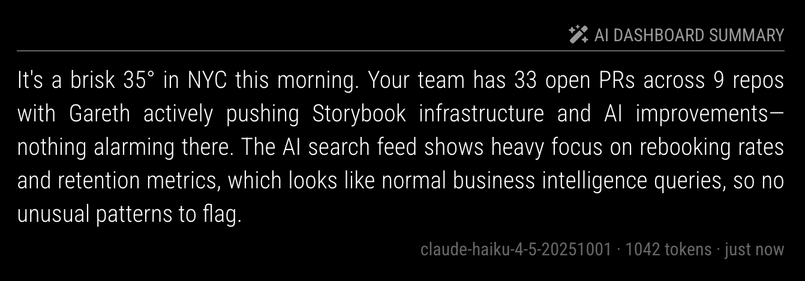

# MMM-LLM-Summary

A [MagicMirror²](https://magicmirror.builders/) module that uses an LLM to summarize other modules on your dashboard. Reads text content from configured modules and generates a brief AI summary.

Supports any OpenAI-compatible API — OpenAI, Anthropic, Ollama, LM Studio, and more.



## Features

- Scrapes text from any MagicMirror module via CSS selectors
- Server-side API calls via node_helper (API key never in browser)
- Smart change detection — ignores timestamp changes like "2 min ago" → "3 min ago"
- Diff-based prompts — only sends changed module data to the LLM, reducing token usage
- Adaptive regeneration — faster polling when data changes, slower when idle
- Quiet hours — pause LLM calls overnight to save costs
- Response caching with data-change detection

## Installation

```bash
cd ~/MagicMirror/modules
git clone https://github.com/garethsprice/MMM-LLM-Summary.git
cd MMM-LLM-Summary
npm install --production
```

## Update

```bash
cd ~/MagicMirror/modules/MMM-LLM-Summary
git pull
npm install --production
```

## Configuration

Add the following to the `modules` array in your `config/config.js`:

```javascript
{
  module: "MMM-LLM-Summary",
  position: "top_right",
  header: "AI Dashboard Summary",
  config: {
    apiKey: "your-api-key",
    baseURL: "https://api.anthropic.com/v1/",
    model: "claude-haiku-4-5-20251001",
    modules: [
      { name: "Weather", selector: ".weather" },
      { name: "Calendar", selector: ".calendar" },
    ],
  },
}
```

### Config Options

| Option | Default | Description |
|--------|---------|-------------|
| `apiKey` | `""` | API key for your LLM provider |
| `baseURL` | `https://api.openai.com/v1` | Provider endpoint |
| `model` | `gpt-4o-mini` | Model name |
| `maxTokens` | `150` | Max response tokens |
| `temperature` | `0.7` | Response creativity (0-1) |
| `systemPrompt` | *(built-in)* | System prompt override |
| `userPrompt` | *(built-in)* | User prompt appended after module data |
| `regenerateInterval` | `3600000` (60 min) | Baseline regeneration interval |
| `fastRegenerateInterval` | `900000` (15 min) | Interval used after data changes |
| `cacheTTL` | `300000` (5 min) | Cache duration — skips LLM call if data unchanged |
| `collectDelay` | `10000` (10s) | Wait for other modules to render before first collect |
| `quietHoursStart` | `null` | Hour to pause generation (24h format, e.g. `22`) |
| `quietHoursEnd` | `null` | Hour to resume (e.g. `8`) |
| `modules` | `[]` | Modules to scrape (see below) |
| `showModel` | `false` | Show model name in footer |
| `showTimestamp` | `true` | Show when summary was generated |
| `showTokenSavings` | `false` | Show "cached" when serving cached response |
| `maxDisplayLength` | `500` | Truncate displayed summary text |

### Module Sources

Each entry in `modules` tells the LLM what to read:

| Field | Required | Description |
|-------|----------|-------------|
| `name` | Yes | Label sent to the LLM (e.g. "Weather") |
| `selector` | No | CSS selector to find the module DOM element. Defaults to `.{name}` |
| `maxLength` | No | Truncate scraped text to this many characters |

### Provider Examples

| Provider | `baseURL` | `model` |
|----------|-----------|---------|
| OpenAI | `https://api.openai.com/v1` | `gpt-4o-mini`, `gpt-4.1-nano` |
| Anthropic | `https://api.anthropic.com/v1/` | `claude-haiku-4-5-20251001` |
| Ollama | `http://localhost:11434/v1` | `llama3.2` |
| LM Studio | `http://localhost:1234/v1` | `local-model` |

## How It Works

1. After `collectDelay`, the frontend scrapes text from each configured module's DOM element
2. Text is normalized (relative times stripped) and compared to previous data to detect meaningful changes
3. If data changed, a diff-based prompt is built — only changed modules are sent in full, unchanged ones listed by name
4. The prompt is sent to `node_helper.js` via socket notification (API key stays server-side)
5. `node_helper.js` calls the LLM and caches the response
6. On subsequent checks, if data hasn't meaningfully changed and cache is fresh, the cached response is returned without an LLM call
7. After data changes, the module switches to `fastRegenerateInterval` for quicker updates, reverting to `regenerateInterval` after 10 minutes of stability
8. During quiet hours, no LLM calls are made — the header shows a moon icon and "paused"

## Token Optimization

The module minimizes LLM costs through several mechanisms:

- **Smart hashing** — Relative timestamps ("2 min ago") and ISO dates are stripped before comparing data, so a clock ticking doesn't trigger unnecessary calls
- **Diff prompts** — After the first call, only changed module data is sent. Unchanged modules are listed as "Unchanged: Weather, Calendar" instead of their full text
- **Adaptive polling** — Calls the LLM less frequently when nothing is happening (60 min baseline), more frequently after changes (15 min)
- **Quiet hours** — Zero API calls during configured hours (e.g. overnight)
- **Cache** — Serves cached responses when data hasn't meaningfully changed

## Tips

- Use `maxLength` on verbose modules to keep token usage down
- Set `collectDelay` high enough for all modules to fetch their data first
- For local LLMs, point `baseURL` at your Ollama/LM Studio instance — no API key needed
- The `systemPrompt` is the best lever for controlling output style and length
- Add `"Do not use emojis."` to the system prompt if your display lacks emoji fonts
- Set `quietHoursStart`/`quietHoursEnd` to avoid paying for summaries nobody will see
